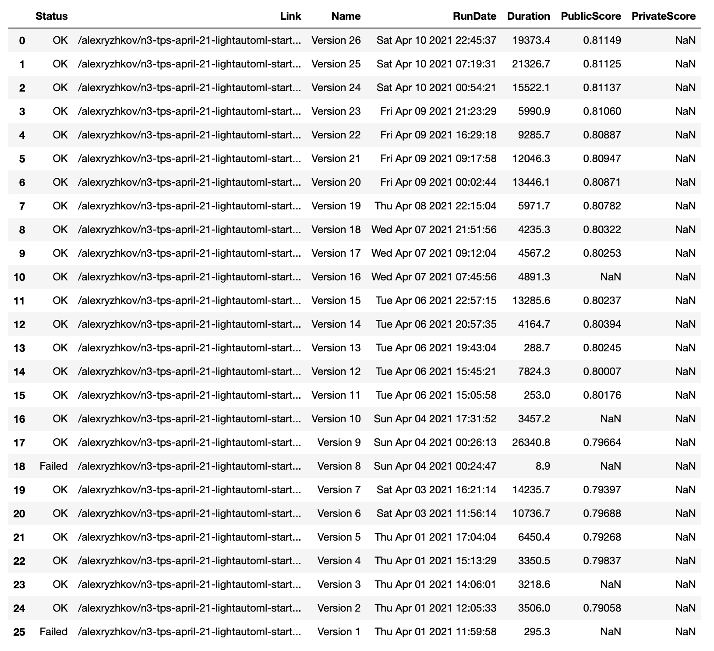

# kaggle-kernels-helper

If you are tired to figure out where is the version of kaggle kernel with the best score - we are here to help you :)

**Note:** you need to download chromedriver and put it in the local folder near the `main.py`



To receive this example output:
```
python3 main.py https://www.kaggle.com/alexryzhkov/n3-tps-april-21-lightautoml-starter output.csv
```
